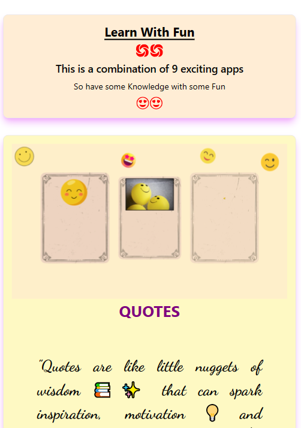
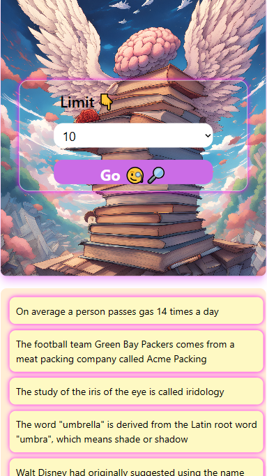
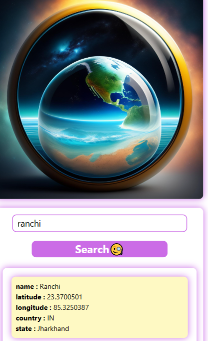
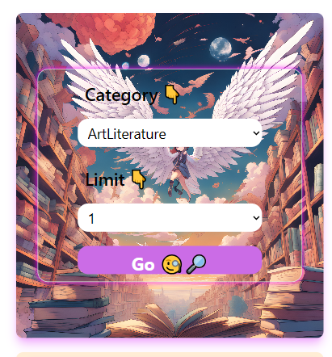
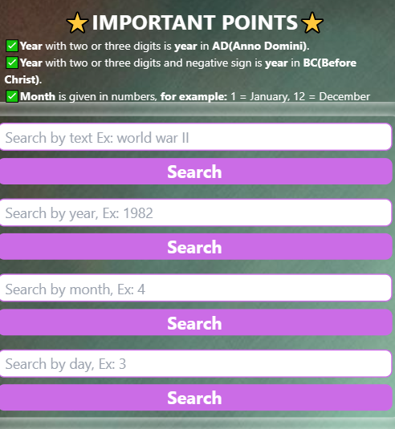
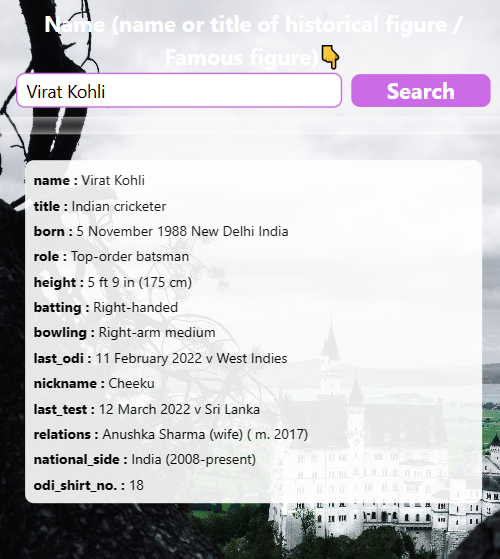
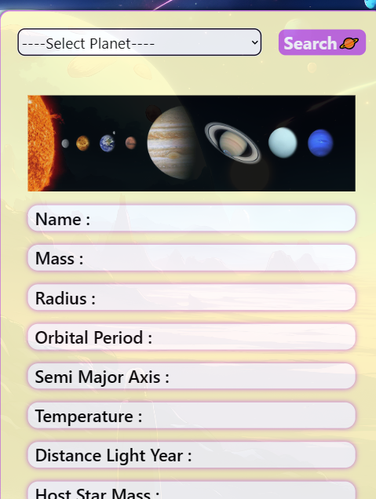
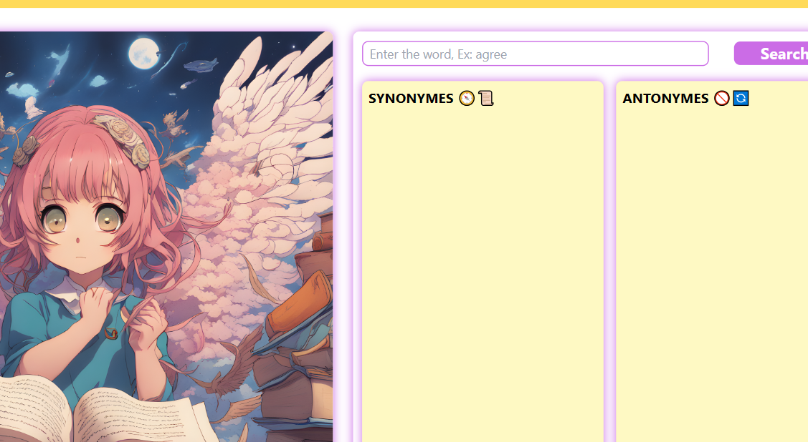

## Learn With Fun
 Explore a diverse collection of 9 innovative apps on our website, covering geocoding, trivia, and more. Enhance your online experience with our versatile tools. Built with React, Javascript, HTML and Telwind CSS.

## Apps 
### 1. Quotes :  
#### Generates random quotes based on your selection.
### 2. Facts : 
#### Find amazing facts about world.
### 3. Geocoding : 
#### Get geolocation of your city.
### 4. Riddles : 
#### Solve the riddles and sharp your brain
### 5. Trivia : 
#### Test your general knowledge based on different categories.
### 6. Historical Events : 
#### Serch and find out about most famous historical events.
### 7. Historical Figures : 
#### Search and get amazing information about world leaders and celeberities of the past and at present.
### 8. Planets : 
#### Know the planets.
### 9. Thesaurus : 
#### Find synonymes and antonymes of thousands of english words.

## Project Screen Shot (s)

## Reflection
#### This is a one and half week long project built to get some experience on react, it's components and hooks.

#### This project is API based project. All the data is coming from https://api-ninjas.com/ API

#### The projects is fully responsive and has easy to use frontend.

#### The most difficult part for me was to use react hooks because was using them for first time to this extent.

#### I used 'npm create vite@latest' to create my project.

## Credits
#### https://api-ninjas.com/
#### pexels
#### Freepik
#### Canva